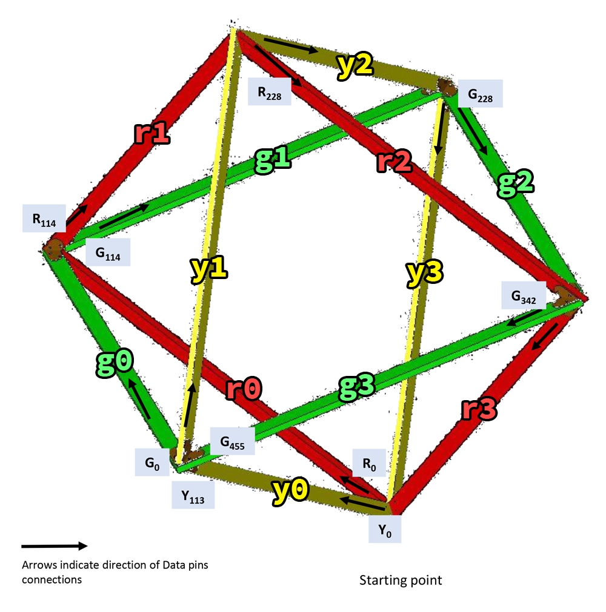

# Bedouin Tech 2017 Presents: Geodesic Temple -CRYPTO-

## Important

I've renumbered the original Teensy Strips from 1-8 to 0-7. This is better aligned to computer programming thinking as the index of the first element in a data structure is 0.

## Single Unit

### Strip Layout

- Each square is a single strip
- There are 3 squares:
  - green
  - yellow
  - red
- Each strip is 456 LEDs in length
- There are 4 beams per square
  - The LED indices for the beams:
    - beam 0: 0 - 113
    - beam 1: 114 - 227
    - beam 2: 228 - 341
    - beam 3: 342 - 455

#### Pin layout

- pin 2:  strip #0  (green)
- pin 14: strip #1 (yellow)
- pin 7:  strip #2 (red)

### Triangle Faces

- A face is a triangle consisting of 3 beams
- The layout of faces are modeled after an 8-sided die.
- The minus symbol (-) indicates the LEDs flow in the reverse direction.
- A beam is described in the format `[sn(-), sn(-), sn(-)]`
  - s: Which strip index, denoted by rgb
  - n: The beam index
  - -: If present, this indicates the flow is reversed
- i.e. `[r2, g3, y1-]`:
  - strip 2 beam 2 -> strip 0 beam 3 -> strip 1 beam 1 (reverse)

#### Layout for each face

- face 0: `[y0, g3-, r3]`
- face 1: `[r0, g0-, y0-]`
- face 2: `[y3-, g1-, r0-]`
- face 3: `[r3-, g2-, y3]`
- face 4: `[r1-, g1, y2-]`
- face 5: `[y1, g2, r2-]`
- face 6: `[r2, g3, y1]`
- face 7: `[face == 7]`
