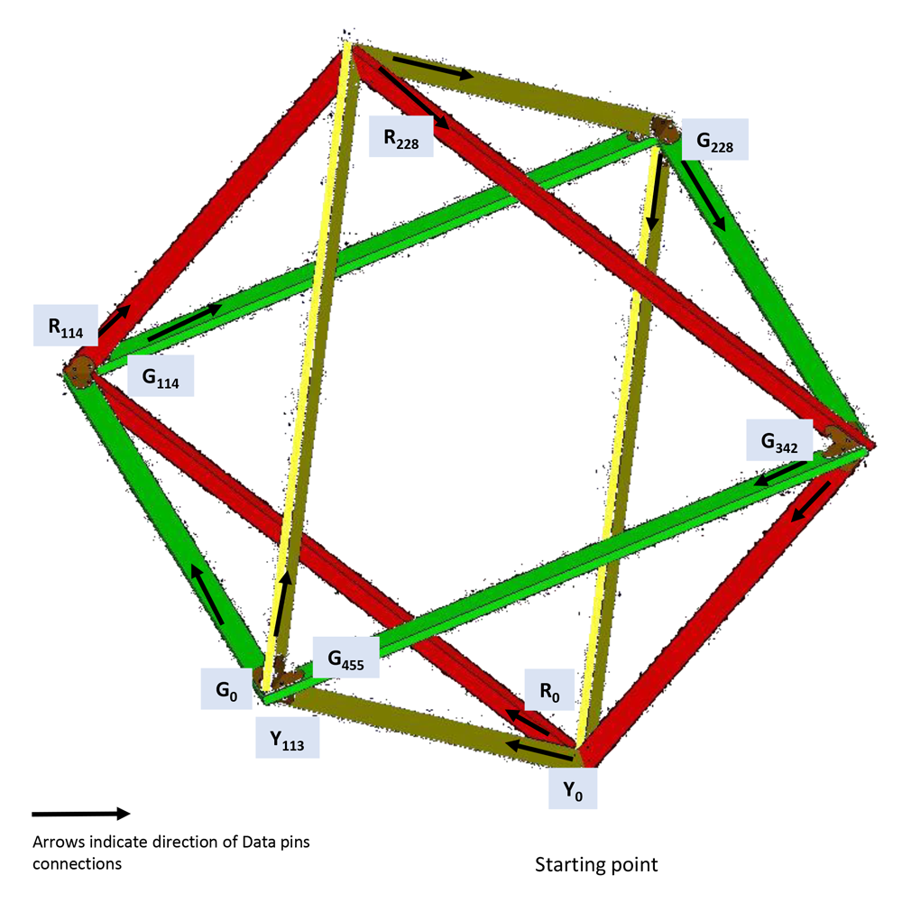

# Bedouin Tech 2017 Presents: Geodesic Temple -CRYPTO-

## Single Unit

### Strip Layout

- Each square is a single strip
- There are 3 squares:
  - green
  - yellow
  - red
- Each strip is 456 LEDs in length
- There are 4 beams per square
  - The LED indices for the beams:
    - beam 0: 0 - 113
    - beam 1: 114 - 227
    - beam 2: 228 - 341
    - beam 3: 342 - 455

#### Pin layout

- pin 2:  strip #0  (green)
- pin 14: strip #1 (yellow)
- pin 7:  strip #2 (red)

### Triangle Faces

- A face is a triangle consisting of 3 beams
- The layout of faces are modeled after an 8-sided die.
- The minus symbol (-) indicates the LEDs flow in the reverse direction.
- A beam is described in the format `xn(-)`, where x is rgb for the beam color, n is the beam index, and a `-` to indicate flow is reversed.
  - i.e. `y0 g0 r0-`:
    - yellow beam 0, green beam 0, red beam 0 (reverse)
    - strip 1 beam 0, strip 0 beam 0, strip 2 beam (reverse)

#### Layout for each

- face 0: `r2  g3  y1`
- face 1: `y1- g0  r1`
- face 2: `r1- g1  y2-`
- face 3: `y2  g2  r2-`
- face 4: `y3- g2  r3`
- face 5: `r3- g3  y0-`
- face 6: `y0  g0  r0-`
- face 7: `r0  g1  y3`
